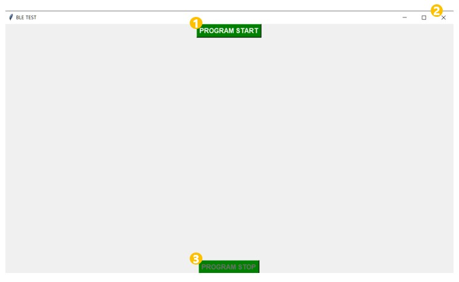
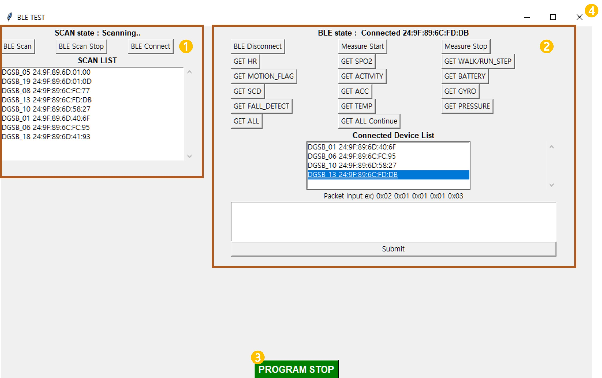
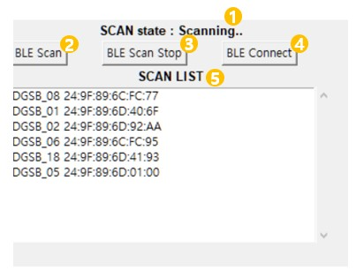
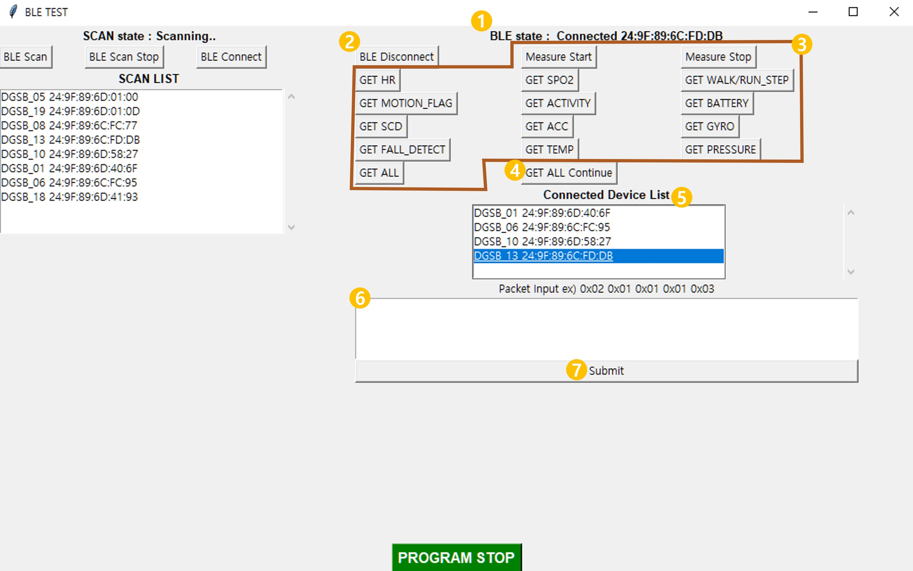
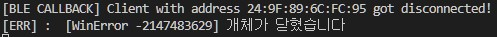
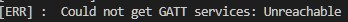
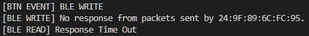
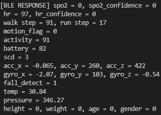
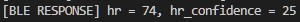

# 코드 실행 방법

## Git Clone

```
git clone https://github.com/jjaekkaemi/dgsb_app.git
```

## 가상환경 생성

```
python -m venv venv
```

## 가상 환경 실행

```
venv\Scripts\activate
```

## python module 설치

```
cd dgsb_app
pip install -r requirements.txt
```

## python 실행

```
python main.py
```

# 프로그램 사용 방법

## 처음 화면



1. BLE Program 시작
2. GUI Program 종료
3. 현재 화면에서는 비활성화

## BLE Program 실행 화면



1. BLE Scan, Stop 및 Connect를 할 수 있는 영역
2. 연결된 BLE의 연결 해제 및 통신을 할 수 있는 영역
3. BLE Program 종료 -> 처음 화면으로 돌아감
   - 연결된 Device가 있을 경우에는 모두 연결 해제를 해야 하기 때문에 처음 화면으로 돌아가는 시간이 느릴 수 있음
4. 비정상적인 종료를 방지하기 위해 BLE Program 실행 상태에서는 종료가 안됨. `PROGRAM STOP` 버튼을 누르고 처음 화면에서 종료해야함.

## BLE Scan 영역



1. BLE Scan 상태를 알려줌 (IDLE, Scanning, Scan Stop)
2. BLE Scan 시작
3. BLE Scan 종료
4. 'SCAN LIST'에서 BLE 연결할 device를 선택하여 연결 시도.
5. 현재 Scan된 Device가 나타나는 리스트

## BLE Connect 영역



1. BLE Connect 상태를 알려줌. (Connecting, Connected, Disconnect)
2. ‘Connected Device List’에서 연결 해제할 Device를 선택하여 연결 해제
3. ‘Connected Device List’에서 선택하여 데이터를 요청 (한 번 누르면 한 번 요청됨.)
4. ‘Connected Device List’에서 선택하여 ‘ALL DATA’를 일정 시간 마다(코드에서 수정 가능) 요청
5. 현재 연결된 Device가 나타남
6. 원하는 패킷을 예시처럼 입력한 후, 7번의 ‘Submit’ 누르면 전송됨

# 참고 사항

## Connect Error




위 상황과 같은 에러가 발생했을 때는 밴드와 앱을 다시 껐다 켜주세요.
Python에서 사용하고 있는 'Bleak' 모듈이 불안정하기 때문에 발생하는 에러 입니다.

## No response



현재 안정적인 통신을 위해 write한 패킷의 response가 없을 경우에는 write할 수 없도록 하고, 5초 이내로(측정 시작시에는 30초) response가 없는 경우에는 Time Out 처리가 되도록 한다.

## Data Response and Parsing




현재 read 데이터의 parsing은 위와 같이 print 됩니다. 데이터 받을 때 참고 하시면 됩니다.
코드 부분에서는 `protocol.py`의 `ble_read_parsing()`, `ble_read_classify_cmd()` 함수를 참고해주세요.
txt 파일로 출력하는 기능을 활성화 시키려면 `file_test`를 `True`로 변경해주세요.
